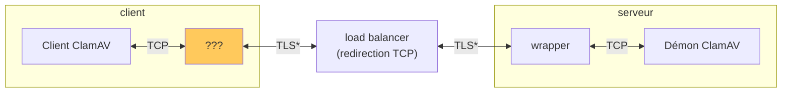

# Un service de scans AntiVirus

... qui wrappe ClamAV, pour l'exposer sur internet.

> IMPORTANT: clamd does not currently protect or authenticate traffic coming over the TCP socket, meaning it will accept commands from any source that can reach that socket. Thus, we strongly recommend following best networking practices when setting up your clamd instance. I.e. don’t expose your TCP socket to the Internet.

_c.f._ https://docs.clamav.net/manual/Usage/Scanning.html#daemon

## Utiliser

Côté client, pour faire vérifier un fichier par l'antivirus, on a besoin d'écrire la logique qui va brancher ce que le client `ClamAV` émet à ce qu'on expose via notre wrapper :



_\*_ Le load balancer ne fait que de la redirection TCP. Donc le tunnel TLS est le même des deux côtés : expose un même certificat serveur, et accepte un même certificat client.
_c.f._ https://www.clever.cloud/developers/doc/administrate/tcp-redirections/

On commence par générer un certificat qui identifiera un client valide aux yeux du wrapper :

```shell
source tls.sh
source tests/fixtures/tls.sh
genere_demande_de_signature_de_certificat_client client.key client.csr
# avec le `ca.crt` qui a servi à démarrer le serveur (et la `ca.key` correspondante)
signe_certificat_client ca.crt ca.key client.csr client.crt
```

Puis on crée la plomberie qui encapsule le traffic émis par le client `ClamAV` dans le tunnel TLS :

```shell
local_port=4242

# la redirection de port TCP doit être effective sur la plateforme
# le `s.crt` a été copié depuis le serveur
socat \
  "TCP-LISTEN:$local_port",reuseaddr,fork \
  "OPENSSL:<DOMAINE APPLICATION>:<PORT REDIRECTION TCP>,cert=$(pwd)/client.crt,key=$(pwd)/client.key,cafile=$(pwd)/s.crt,verify=1" &
```

Alors, on peut utiliser le client `ClamAV` pour scanner des fichiers :

```shell
cat <<_EOF_ >clamav.conf
TCPAddr 127.0.0.1
TCPSocket $local_port
_EOF_

cat <FICHIER À SCANNER> | clamdscan --config=clamav.conf -
```

## Contribuer

```shell
# obtenir un environnement contenant les outils nécessaires
nix-shell

# lancer les tests
$ bash_unit tests/*.test.sh
# valide le formattage
$ treefmt
```
